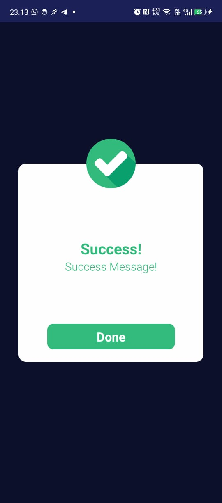
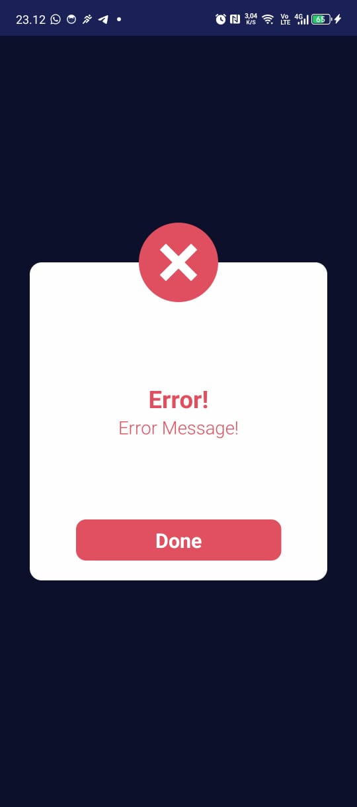
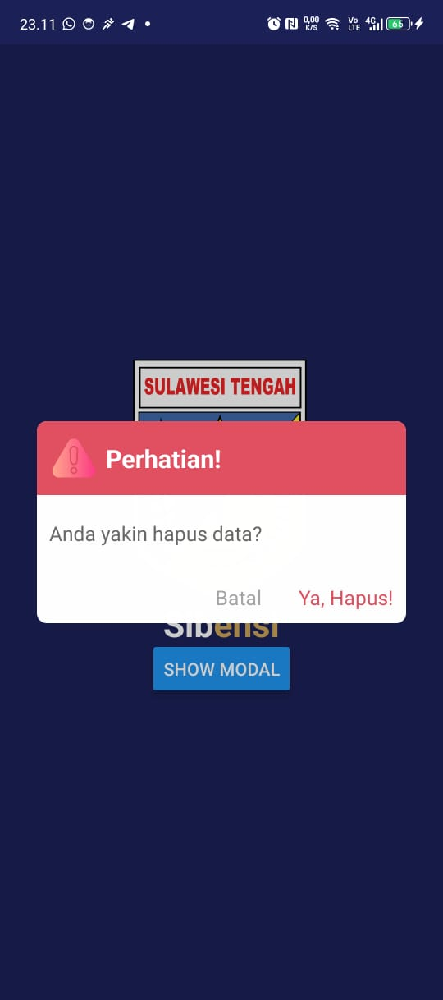

# react-native-modal-message

React Native Modal Message

| Success Modal                             | Error Modal                           | Confirm Modal                                     |
| ----------------------------------------- | ------------------------------------- | ------------------------------------------------- |
|  |  |  |

## Installation

```sh
npm install react-native-modal-message
```

## Usage

1. Go to file App.js

```js
// Library yang lain
import { ModalProvider } from 'react-native-modal-message';

const App = () => {
  return (
    <ModalProvider>
      <NavigationContainer>
        <Routes />
      </NavigationContainer>
    </ModalProvider>
  );
};

export default App;
```

2. Use of modal success

```js
import { useModal } from 'react-native-modal-message';

const MyScreen = () => {
  const { showSuccessModal } = useModal();

  return (
    <View>
      <Button
        title="Show Modal"
        onPress={() => showSuccessModal('Success Message!', 'Done', () => null)}
      />
    </View>
  );
};

export default MyScreen;
```

3. Use of modal error

```js
import { useModal } from 'react-native-modal-message';

const MyScreen = () => {
  const { showErrorModal } = useModal();

  return (
    <View>
      <Button
        title="Show Modal"
        onPress={() => showErrorModal('Error Message!', 'Done', () => null)}
      />
    </View>
  );
};

export default MyScreen;
```

4. Use of modal confirm

```js
import { useModal } from 'react-native-modal-message';

const MyScreen = () => {
  const { showModalConfirm } = useModal();

  return (
    <View>
      <Button
        title="Show Modal"
        onPress={() =>
          showErrorModal(
            'Header Text!',
            'Body Text',
            'Text Cancel',
            'Text Action',
            () => null
          )
        }
      />
    </View>
  );
};

export default MyScreen;
```

## Contributing

See the [contributing guide](CONTRIBUTING.md) to learn how to contribute to the repository and the development workflow.

## License

MIT

---

Made with [create-react-native-library](https://github.com/callstack/react-native-builder-bob)
